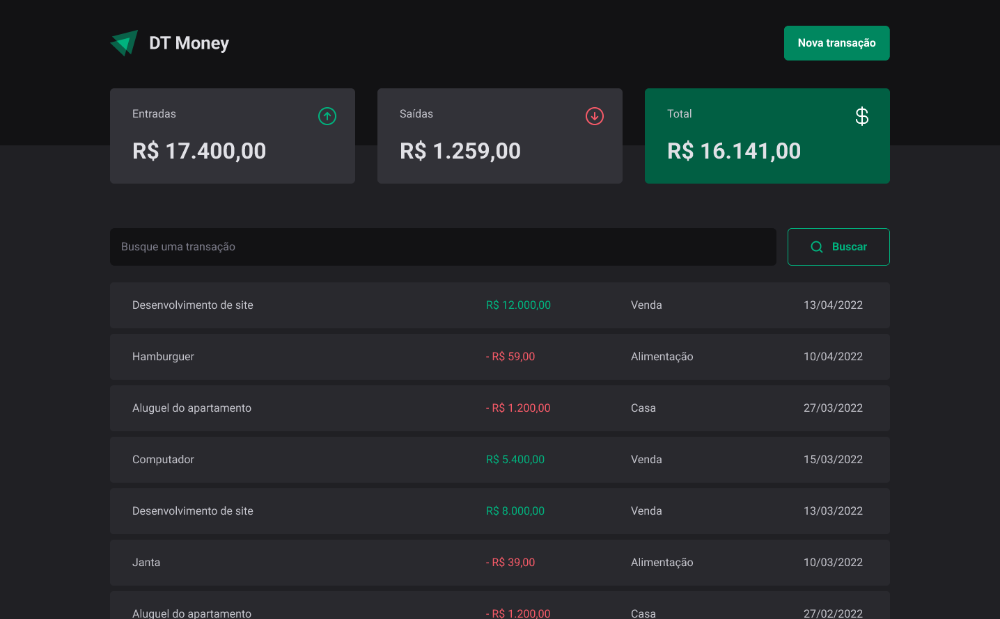
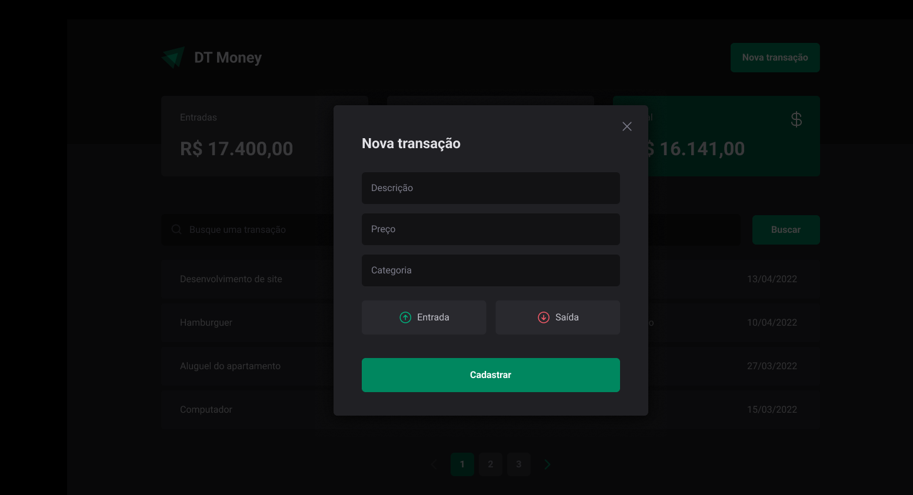

 

Desafio do Ignite, proposto na trilha de React, com o objetivo de abordar de forma teórica e prática os fundamentos do ReactJS, incluindo os princípios dos hooks, o gerenciamento de estados e o ciclo de vida dos componentes.

  <a href="#-tecnologias">Tecnologias</a>&nbsp;&nbsp;&nbsp;|&nbsp;&nbsp;&nbsp;
  <a href="#-projeto">Projeto</a>&nbsp;&nbsp;&nbsp;|&nbsp;&nbsp;&nbsp;
  <a href="#-layout">Layout</a>&nbsp;&nbsp;&nbsp;|&nbsp;&nbsp;&nbsp;
  <a href="#memo-licença">Licença</a>

  

 

  

  

## 🚀 Tecnologias

Esse projeto foi desenvolvido com as seguintes tecnologias:

- ReactJs
- TypeScript
- Styled Components
- Context API
- React Hook Form
- React Router DOM
- Zod
- Axios

## 💻 Projeto

Este projeto tem como objetivo criar um controle financeiro para o usuário, permitindo o registro das entradas e saídas diárias. Além disso, o usuário pode utilizar o campo de busca para filtrar transações por itens ou categorias específicas.

Nos bastidores, o projeto implementa diversas funcionalidades, como o uso do React Hook Form e Zod para gerenciamento de formulários, e Context para otimizar o gerenciamento de variáveis. Também foram aplicadas otimizações para evitar renderizações desnecessárias nos componentes, garantindo melhor performance.

## 🔖 Layout

Você pode visualizar o layout do projeto através [DESSE LINK](<https://www.figma.com/design/UIOG3xLP6dpD9udAGoxTiK/DT-Money-(Community)?node-id=0-1&p=f&t=tVwzI2B8Px7tGdP2-0>). É necessário ter conta no [Figma](https://figma.com) para acessá-lo.

## :memo: Licença

Esse projeto está sob a licença MIT.

---
